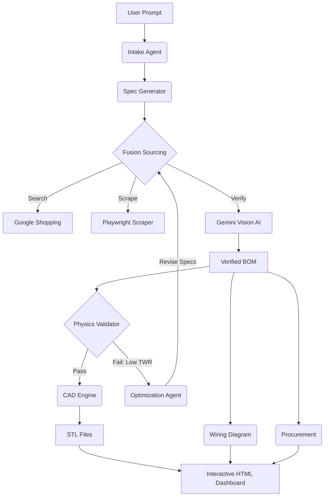

# OpenForge
**The First Open Source Autonomous Supply Chain Agent.**

[](https://www.gnu.org/licenses/agpl-3.0)
[](https://www.python.org/downloads/)
[](https://deepmind.google/technologies/gemini/)
[]()

> **"Don't just generate code. Generate physical objects."**

---

## 📜 Manifesto

This is not a chatbot. It is an **Agentic Framework** that acts as a Chief Engineer, Sourcing Manager, and Physics Simulator in one. It takes a prompt, validates the physics, finds the real parts in stock, and generates the files to build it.

**We are building the "Linux of Manufacturing."**

---

## 🧠 How It Works
Unlike standard LLMs which hallucinate physical specifications, OpenForge uses a **Hardware-Aware architecture**. It grounds its creativity in reality by using Computer Vision to read datasheets, Python simulations to validate flight physics, and OpenSCAD to generate physical geometry.

### The "Self-Healing" Loop
The core differentiator is the **Optimization Agent**. If the sourced parts fail the physics simulation (e.g., TWR < 1.5), the system doesn't error out. It *reasons* about the failure, swaps components (e.g., "Upgrade motors from 2207 to 2306"), and re-simulates until it passes.



---

## ✨ Key Features

*   **⚛️ Data Fusion Sourcing:** Orchestrates parallel searches across multiple vendors. It merges the best *pricing* data with the best *technical* data to create a "Composite Component."
*   **👁️ Multimodal Vision Verification:** Uses **Gemini Pro Vision** to "look" at product images and extract critical engineering constraints (e.g., measuring bolt patterns from a JPEG) that are missing from text descriptions.
*   **🚀 Physics Sandbox:** Runs a physics engine (`calc_twr.py`) to calculate Thrust-to-Weight Ratios (TWR), Disk Loading, and estimated flight times *before* you buy a single part.
*   **📐 Generative CAD:** Dynamically generates `.scad` and `.stl` files for the frame, tailored to the exact dimensions of the sourced components.
*   **⚡ Automated Electrical Schematics:** Generates a visual wiring diagram (PNG) showing exactly how to connect the specific peripherals (GPS, Receiver, VTX) to the selected Flight Controller using Graphviz.

---

## 🛠️ Tech Stack

*   **Core:** Python 3.10+ (AsyncIO)
*   **State Management:** JSON-based Manifests (No DB required for Beta)
*   **Intelligence:** Google Gemini Pro (Logic) + Gemini Pro Vision (Visual Extraction)
*   **Reconnaissance:** Scraper / Google Search API
*   **Engineering:** OpenSCAD (Parametric CAD), Graphviz (Schematics), NumPy (Physics)

---

## 🚀 Getting Started

### Prerequisites
*   **Python 3.10+**
*   **Google Gemini API Key** (Free tier available)
*   **OpenSCAD** (Must be in your system PATH)
*   **Graphviz** (Must be in your system PATH)

### 1. Clone the Repository
```bash
git clone https://github.com/yourusername/OpenForge.git
cd OpenForge
```

### 2. Environment Setup
Create a `.env` file in the root directory:
```bash
GOOGLE_API_KEY="your_gemini_key_here"
# Optional: Required only for live sourcing mode
SERPER_API_KEY="your_serper_key_here"
```

### 3. Install Dependencies
```bash
# Install System Tools (Debian/Ubuntu)
sudo apt-get update && sudo apt-get install openscad graphviz

# Install Python Deps
pip install -r requirements.txt
```

### 4. Run the Master Pipeline
Witness the entire lifecycle from prompt to dashboard:

```bash
python -m scripts.test_all_systems
```

*The system will analyze your prompt, source parts, run physics sims, and generate the `master_build_guide.html` file in the `static/generated` folder.*

---

## 🤝 Contributing & Roadmap

**This project is community-driven.** We are looking for contributors to help expand beyond drones into other hardware verticals (Robotics, IoT, PCBs).

*   [ ] **Database:** Migration from JSON files to PostgreSQL/Redis.
*   [ ] **New Scrapers:** Help us support DigiKey, Mouser, and AliExpress.
*   [ ] **Improve Physics:** Add drag coefficient calculations for different frame geometries.
*   [ ] **Frontend:** Port the dashboard to React/Next.js.

**Found a bug?** Open an issue.
**Have a feature idea?** Join the discussion on [Discord](Link_To_Discord) or submit a PR.

---

## ⚠️ Disclaimer

*   **Safety:** Lithium Polymer (LiPo) batteries and high-speed propellers are dangerous. This tool generates *theoretical* designs. Always verify wiring diagrams and physics calculations manually.
*   **Scraping:** The reconnaissance module uses a headless browser to scrape public e-commerce data. Respect `robots.txt` and rate limits.

---

## 📜 License

**AGPL v3 License.**

*   **Free for Open Source:** You are free to use, modify, and distribute this software for open projects.
*   **Paid for Closed Source:** If you use this code in a proprietary service, you *must* open-source your changes or contact us for a commercial license.
```
