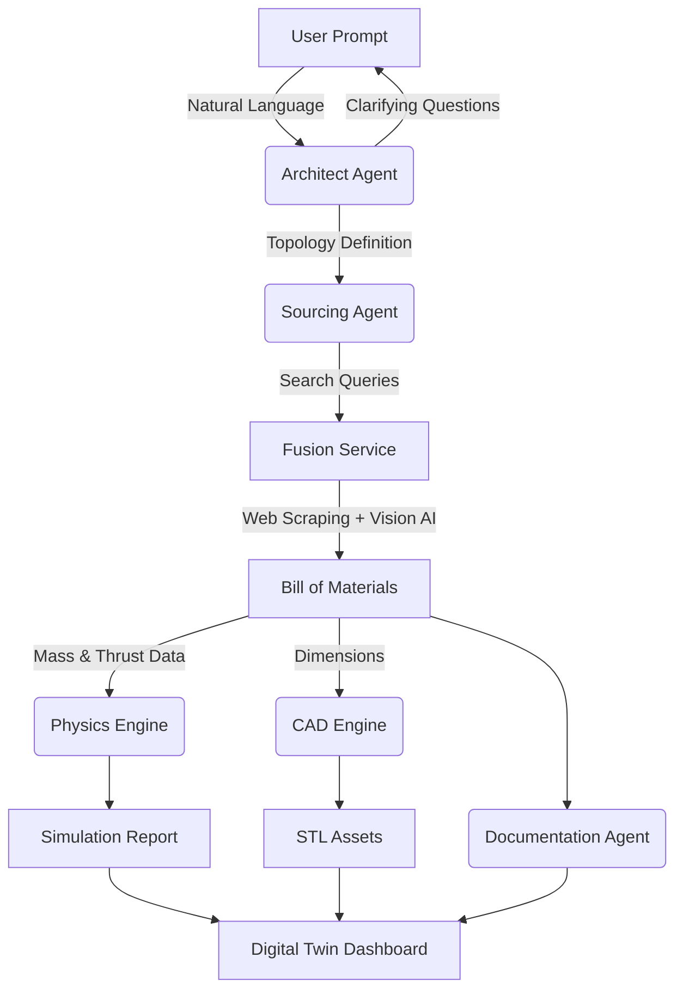

# OpenForge: The Autonomous Drone Architect


**OpenForge** is an AI-powered "Hardware Compiler." It transforms natural language requests into fully engineered, flight-ready drone designs.

Unlike standard chatbots that hallucinate hardware, OpenForge uses a **Cyber-Physical Agentic Loop**: it interviews the user, browses the real internet for parts, reads technical diagrams using Computer Vision, simulates flight physics, generates manufacturing files (CAD), and renders a 3D Digital Twin.

---

## 🚀 Features

### 1. Cognitive Engineering Agents
*   **The Architect:** Determines the optimal topology (e.g., "Heavy Lift Octocopter" vs. "Tiny Whoop") based on user intent.
*   **The Chief Engineer:** Refines constraints, determines fastening methods, and ensures voltage/KV matching.

### 2. Fusion Sourcing Engine
*   **Real-Time Search:** Scrapes the web for current components and prices.
*   **Vision AI:** Uses Multimodal LLMs to "look" at product images and read mounting patterns, USB orientations, and dimensions that aren't listed in the text description.

### 3. Physics & Simulation
*   Calculates Thrust-to-Weight Ratio (TWR), Disk Loading, and estimated Hover Throttle.
*   Simulates PID loop responses to generate flight telemetry logs.

### 4. Generative Fabrication (CAD)
*   Procedurally generates **OpenSCAD** scripts based on the specific dimensions of sourced parts.
*   Exports STL files for the frame, motors, flight stack, and batteries.

### 5. Digital Twin Dashboard
*   Interactive WebGL (Three.js) visualizer.
*   Step-by-step assembly guide generated dynamically for the specific parts list.
*   Flight telemetry charts.

---

## 🛠️ Architecture

OpenForge operates as a linear pipeline of specialized agents:



---

## 📦 Installation

### Prerequisites
*   **Python 3.10+**
*   **OpenSCAD** (Required for CAD generation)
    *   *Linux:* `sudo apt install openscad`
    *   *Mac:* `brew install --cask openscad`
    *   *Windows:* Download installer from openscad.org
*   **Google Gemini API Key**

### Setup

1.  **Clone the repository**
    ```bash
    git clone https://github.com/yourusername/openforge.git
    cd openforge
    ```

2.  **Create a virtual environment**
    ```bash
    python -m venv venv
    source venv/bin/activate  # On Windows: venv\Scripts\activate
    ```

3.  **Install dependencies**
    ```bash
    pip install -r requirements.txt
    playwright install  # For the web scraper
    ```

4.  **Configure Environment**
    Create a `.env` file in the root directory:
    ```ini
    GOOGLE_API_KEY=your_gemini_api_key_here
    GOOGLE_SEARCH_ENGINE_ID=your_cse_id_here # Optional, falls back to direct scraping
    ```

---

## 🖥️ Usage

Run the main entry point. The system handles the rest.

```bash
python main.py
```

**The Workflow:**
1.  **Intake:** You will be asked what you want to build (e.g., *"A rugged 5-inch freestyle drone for under $400"*).
2.  **Interview:** The AI will ask clarifying questions (e.g., *"Do you need Analog or Digital video?"*).
3.  **Processing:** Watch the console as the agents scrape the web, analyze images, and simulate physics.
4.  **Result:** A browser window will automatically open displaying the **Mission Dashboard**.

### Output
All artifacts are saved to the `output/` directory:
*   `dashboard.html`: The interactive visualizer.
*   `master_record.json`: The "Source of Truth" containing all reasoning and specs.
*   `*.stl`: The generated 3D models.

---

## 📂 Project Structure

```text
openforge/
├── app/
│   ├── services/
│   │   ├── ai_service.py       # LLM Interaction & Logic
│   │   ├── fusion_service.py   # Search + Scrape + Vision
│   │   ├── cad_service.py      # OpenSCAD Generation
│   │   └── physics_service.py  # Mathematical Simulation
│   ├── cad/                    # SCAD Libraries
│   └── prompts.py              # System Instructions & Axioms
├── templates/
│   └── dashboard.html          # WebGL Viewer Template
├── output/                     # Generated Artifacts
└── main.py                     # Application Entry Point
```

---

## ⚠️ Disclaimer

**OpenForge is a prototype.**
*   **Safety:** Always verify the generated Bill of Materials before purchasing.
*   **Physics:** Simulations are mathematical approximations based on scraped data.
*   **Sourcing:** Web scrapers may break if target websites change their DOM structure.

---

## 🤝 Contributing

Contributions are welcome! Please focus on:
1.  **New Parts Libraries:** Improving the `cad/` OpenSCAD modules.
2.  **Scrapers:** Adding support for more drone retailers.
3.  **Physics:** Improving the accuracy of the drag/thrust models.

## 📄 License

**AGPL v3**. See `LICENSE` for details. This software is open source, but if you modify it and provide it as a service, you must share your source code.
