HUman notes:

I challenged myself to test the new Gemini 3.0 to see how far its reasoning capabilities could push actual engineering tasks. The result is OpenForge: a Neuro-Symbolic Manufacturing Engine that translates user intent into flight-proven hardware designs and generates a physics-based simulation to test them. An AI system that builds its own inventory, creates virtual products, and simulates mission-critical robotics.

These are may unstructured human notes. I will clean them up later:

The key learning so far has been the switch from drone to quad. Initially I thought that it would be an easy switch to refactor code using gemini by giving it the drone code as architecture and recontext gemini to adjust the code so that it would create quadrupeds rather than codes. It very confidently spit out new code for each .py module as well as new simulation code. However, as I tested this code it has show serious limitations. From what I can infer these limitations are due to gemini trying to lump all the architecture context code into one working program that looks right on the surface but glosses over the nuance and depth of the original code. For instance the drone code I used was broken into a serious of distinct linear steps with remarks and other battle scares from the build. Rather than noticing that gemini lumped them all together into one process. This has created serious problems in trouble shooting because as things break and are fixed they lead other errors. Basically the code it provided led to cascading failures. While they can be debugged I am finding that if I would have architecture the project differently ie showing gemini the step by step process and the logic i used it would have more than likely created a better code base up front. This is the key difference imo between 2.5 and 3.0. 2.5 would try to do the same thing but the code was truncated and clearly limited forcing the dev to work with the ai to create step by step instructions and task lists execute the build. 3.0 wants to skip this and the code it puts out initially looks really good and will function to a certain degree but the scaffolding is broken from the start.

I guess this means initial arch is still critical and while gemini 3.0 has significant improvements in terms of speed and non hallucinated workable code you still to be cognizant of how you build the initial foundation. If you expect it to one shot pivot code based on an original code base you are going to be disappointing.

Drone_4 works from seed to simulation for drones! I cheated a little bit in the make_fleet.py to rely less on LLM to create the fleet but I had to remind myself that this was a test of Gem 3.0 reasoning and not making things absolutely perfect to avoid going down a needless rabithole.  
Now that I have the pipeline completed to a point in which i am satified the simulation is as best as i can get i will shift from drones to something else like quad or robot arms using hugging face tut: https://huggingface.co/docs/lerobot/en/so101

Quad has been uploaded.  It is an attempt to create quadruped robot from user inference to simulation

End HUman notes

# OpenForge: Neuro-Symbolic Manufacturing Engine

<div align="center">

[](https://www.python.org/)
[](https://www.gnu.org/licenses/agpl-3.0)
[]()


</div>

This is a portfolio piece.  I am actively looking for high-level consulting gigs (Fractional CTO, Principal Engineer) or Team Lead roles.

forge.py: Running the entire search and construction loop using async calls:


sim_in_issac.py: Static simulation of quad robot. Simulation is very blocky.  This is due to limited run of forge.py

seed.py: Understanding intent, generating model, creating search, and looking for parts:


seed_ecosystem.py: Analyzing Dependancies, creating search terms, and finding results:


refine_arsenal.py: Improving Data Integrity:


make_fleet.py: Generating drones from data that has been collected


Drone Simulated in Isaac Sim Python 5.0.0!!!


---

**OpenForge is a research prototype exploring AI-driven design automation. It demonstrates how constraint propagation, multi-modal verification, and
deterministic validation can work together to automate hardware engineering tasks.** 

Traditional AI tools operate on text. OpenForge operates on **Physics and Supply Chains**. It utilizes a multi-agent architecture to scour the global market for components, verify them using Computer Vision, procedurally generate valid engineering assemblies, and simulate them in a browser-based physics engine.

It transforms **Natural Language Intent** (e.g., "I need to inspect fences autonomously") into **Verified Engineering Reality** (BOMs, Blueprints, and Flight Simulations).

## 🚀 Key Capabilities

### 1. The Arsenal (Active Supply Chain)
*   **The Constraint Chain:** We don't just search for "motors." An **Architect Agent** first translates user intent ("Brush Buster") into physics constraints ("Stator Volume > 2306", "Arm Thickness > 5mm").
*   **The Refinery:** A high-agency background worker (`refine_arsenal.py`) that audits the database. If a spec is missing, it spins up a headless browser, **clicks "Specifications" tabs**, reads the DOM, and updates the record.
*   **Visual Forensics:** Uses Vision AI to read PCB silkscreens and technical drawings to verify data that text scrapers miss.

### 2. The Fabricator (Logic-Gated Manufacturing)
*   **The Class Filter:** Instead of random combinations, the engine intelligently buckets parts (e.g., "7-inch Long Range", "Heavy Lift"). It only attempts to build drones with components in the same class.
*   **The Logic Gate:** A deterministic `CompatibilityService` that enforces hard physics rules *before* AI generation:
    *   **Voltage:** Checks `Battery Cells` vs `Motor KV` (Prevents fires).
    *   **Protocol:** Checks `UART Count` vs `Peripherals` (Prevents I/O bottlenecks).
    *   **Geometry:** Checks `Prop Size` vs `Frame Clearance` (Prevents collisions).

### 3. The Virtual Prototyping Lab (Simulation)
*   **Browser-Based Game Engine:** A fully interactive 3D simulator running on **Three.js** and **Cannon.js**.
*   **Real Physics:** Flight characteristics (inertia, drag, thrust) are derived from the actual mass and motor curves of the sourced parts.
*   **Procedural Environment:** The sim generates context-aware environments (Trees, Cows, Buildings) to test the drone's intended use case.

## 🛠️ Architecture

OpenForge separates Data Acquisition, Product Generation, and User Interaction into distinct layers.

```mermaid
graph TD
    %% --- STYLING ---
    classDef agent fill:#1a202c,stroke:#00ff88,stroke-width:2px,color:#fff,rx:5,ry:5;
    classDef data fill:#2d3748,stroke:#F6E05E,stroke-width:2px,color:#fff,shape:cylinder;
    classDef logic fill:#1a202c,stroke:#FF5555,stroke-width:2px,color:#fff,shape:rhombus;
    classDef output fill:#1a202c,stroke:#3182ce,stroke-width:2px,color:#fff;
    classDef cluster fill:#111,stroke:#444,stroke-width:1px,color:#ccc;

    %% --- LAYER 1 ---
    subgraph L1 [Layer 1: The Active Supply Chain]
        direction TB
        Seed[Seed Agent]:::agent -->|Broad Search| Raw[Raw Inventory]:::data
        Raw -->|Audit Missing Specs| Refinery[Refinery Agent]:::agent
        Refinery -->|Agentic Browsing / Clicks| Arsenal[(Verified Arsenal)]:::data
    end

    %% --- LAYER 2 ---
    subgraph L2 [Layer 2: The Factory]
        direction TB
        Arsenal --> Fabricator[Fabricator Script]:::agent
        Fabricator -->|Classify & Bucket| Gate{Logic Gate}:::logic
        Gate -- Physics Fail --> Discard[Discard]:::output
        Gate -- Pass --> Builder[AI Assembler]:::agent
        Builder -->|Mint SKU| Catalog[(Catalog JSON)]:::data
    end

    %% --- LAYER 3 ---
    subgraph L3 [Layer 3: The Interface]
        direction TB
        User((User)):::output -->|Natural Language| Architect[Architect Agent]:::agent
        Architect <-->|Query Matches| Catalog
        Architect -->|Select Anchor| Twin[Digital Twin Generator]:::output
        
        Twin --> Sim[Three.js Flight Sim]:::output
        Twin --> Docs[Assembly Guide]:::output
    end

    %% --- CONNECTIONS BETWEEN LAYERS ---
    %% (Implicitly handled by node placement, but enforced here for clarity)
    style L1 fill:#0d1117,stroke:#333,stroke-width:2px
    style L2 fill:#0d1117,stroke:#333,stroke-width:2px
    style L3 fill:#0d1117,stroke:#333,stroke-width:2px
```

<div align="center">


</div>

## 📦 Installation

#### Prerequisites
*   **Python 3.10+**
*   **Playwright:** Required for the active refinery agent.
*   **Google Gemini API Key:** (Visual Reasoning & Logic)
*   **Google Custom Search API Key:** (Web Recon)

#### Setup
1.  **Clone the repository:**
    ```sh
    git clone https://github.com/your-username/openforge.git
    cd openforge
    ```

2.  **Install dependencies:**
    ```sh
    pip install -r requirements.txt
    playwright install chromium
    ```

3.  **Configuration:**
    Set your API keys in `app/config.py` or environment variables.

## 🖥️ Usage

### 1. Seed & Refine (The Data Loop)
Populate your local database and let the AI "fix" missing data.
```sh
# Step 1: Broad search based on constraints
python tools/seed_arsenal.py

# Step 2: Active investigation (Clicks tabs, reads screenshots)
python tools/refine_arsenal.py

# Step 3: Grade your data quality
python tools/inspect_data_quality.py
```

### 2. Design the Fleet (The Logic Loop)
Ask the AI to select optimal combinations from your refined inventory.
```sh
python tools/design_fleet.py
```

### 3. Fly (The Simulation)
Launch the physics engine.
```sh
python tools/fly_drone.py
```

## 🗺️ Roadmap

| Feature | Status | Description |
| :--- | :--- | :--- |
| **Constraint Solving** | 🟢 **Done** | Translates "intent" to "physics" before sourcing. |
| **Active Refinery** | 🟢 **Done** | Agentic browsing to click UI elements and find hidden specs. |
| **Physics Logic Gate** | 🟢 **Done** | Deterministic code prevents AI from building unflyable drones. |
| **3D Simulator** | 🟢 **Done** | Procedural "Game Engine" based on real component specs. |
| **Feedback Loop** | 🟡 **In Progress** | If a build fails, auto-trigger the Sourcer to find the missing part. |
| **Cost Optimization** | 🔴 **Planned** | Genetic algorithm to find the cheapest valid configuration. |

## 📄 License

This project is licensed under the AGPL v3.
```
