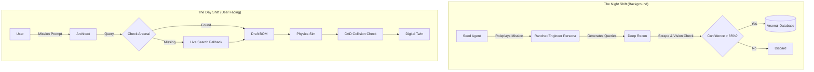

Feasibility Matrix: The Roadmap from 7/10 to 9.5/10
Feature	Feasibility (Now)	Required Tech / Tools	Primary Challenge	Verdict
1. Constraint Solving	10/10	python-constraint library	Data Extraction: Reliably getting the numbers (e.g., mounting_mm) from the BOM to feed into the solver. The solver itself is simple.	Yes, Immediately. This is a pure software task and a huge reliability win.
2. Curated Database	10/10	SQLite, PostgreSQL	Human Labor: Manually populating and verifying 500+ components is a massive, expert-driven data entry task.	Yes, Immediately. The bottleneck is human effort, not technology.
3. Empirical Correction	9/10	numpy, scikit-learn	Data Pipeline: Building the infrastructure to collect, clean, and process user-submitted flight logs. The math is straightforward.	Yes. The basic correction factors are easy. The full RL loop is a larger data engineering project.
4. Firmware Matrix	8/10	Python Dictionaries, JSON Schema	Knowledge Codification: An expert must manually translate "tribal knowledge" into a machine-readable format. It's brittle and needs constant maintenance.	Yes, but it requires expert input. It's a manual knowledge-base creation task.
5. Thermal/Vibration	7/10	numpy, scipy	Model Derivation: The code is easy, but the simplified physics formulas must be derived from academic papers or real-world experiments. You can't just guess them.	Yes, if you have the physics expertise. The challenge is in the physics modeling, not the programming.
6. Human Escalation	10/10	Slack API, Zendesk API, Email Lib	Operational: Who is the expert on the other end? How is their feedback ingested back into the system? It's a workflow design problem.	Yes, trivially. The technology for creating and routing tickets is very mature.
7. Regulatory/Safety	9/10	Python Dictionaries, JSON	Legal Maintenance: Drone laws change constantly and vary by region. Keeping the rule set up-to-date is a non-trivial legal/administrative task.	Yes. A basic version for a single region (e.g., the >250g FAA rule) is very easy to implement.
8. Continuous Learning	7/10	Database, ML Framework, Job Scheduler	MLOps Infrastructure: This is a full MLOps project requiring a data pipeline, retraining scripts, and model deployment strategies.	Yes, but it's a significant project. The tools all exist, but this is a complex system to build.


# OpenForge: Autonomous Supply Chain & Engineering Platform

<div align="center">

[](https://www.python.org/)
[](https://www.gnu.org/licenses/agpl-3.0)
[]()

**The "Iron Man" Protocol for Hardware Engineering.**  
An AI system that builds its own inventory, verifies components with computer vision, and designs mission-critical drones.

</div>

---

**OpenForge is not a chatbot.** It is an automated engineering firm.

Most AI engineering tools are "Reactive"—they wait for a user to ask for a part, then try to scrape the web, often hallucinating specifications. OpenForge is **"Proactive."** It utilizes a background "Night Shift" agent that relentlessly scours the global supply chain, verifying components using Computer Vision, and building a local "Arsenal" of trusted parts.

When you ask OpenForge to build a drone, it doesn't guess. It consults its verified inventory, simulates the physics, checks for CAD collisions, and offers a strategic choice: **Buy** an off-the-shelf solution, or **Build** a custom rig.

## 🚀 Key Capabilities

### 1. The "Arsenal" (Inventory Engine)
*   **The Night Shift:** A background agent (`seed_arsenal.py`) runs autonomously to hunt for components. It roleplays different personas (Rancher, Racer, Cinema) to find diverse parts.
*   **Vision Verification:** The system refuses to trust text descriptions. It uses **Gemini Vision** to read technical datasheets and diagrams. It only adds a part to the database if it identifies critical specs (mounting patterns, dimensions, voltage) with **>85% confidence**.
*   **Persistent Memory:** Verified parts are stored in a local JSON database, allowing for instant, zero-hallucination lookups during design.

### 2. The "Consultant" (Buy vs. Build)
*   **Market Scout Agent:** When presented with a mission, OpenForge doesn't just try to build a robot. It also scans the market for Commercial Off-The-Shelf (COTS) solutions (e.g., DJI Enterprise, Autel).
*   **Strategic Output:** The final dashboard presents a comparison: The estimated cost and effort to build a custom verified design vs. the price and specs of an immediate purchase.

### 3. The "Architect" (Design Core)
*   **Mission-Driven Design:** Translates vague requests (e.g., "Find lost calves in brush") into engineering constraints (e.g., "High-torque motors, propeller guards, thermal camera").
*   **Supply Chain Logic:** Prioritizes parts from the local verified Arsenal. Only triggers a "Deep Web Search" if the local inventory cannot satisfy the mission requirements.

### 4. Validation & Digital Twin
*   **Physics Simulator:** Calculates flight time, thrust-to-weight ratio, and disk loading based on the *actual* weights of verified parts.
*   **Generative CAD:** Procedurally generates 3D models (OpenSCAD) to check for geometric collisions (e.g., "Does the battery fit inside this specific frame?").
*   **Web Dashboard:** Renders a 3D interactive model, assembly guide, and flight log simulation in the browser.

## 🛠️ Architecture

OpenForge separates the **Data Acquisition** (Seeding) from the **Engineering** (Building).

<div align="center">


</div>

## 📦 Installation

#### Prerequisites
*   **Python 3.10+**
*   **OpenSCAD:** Required for 3D model generation.
    *   Linux: `sudo apt install openscad`
    *   Mac: `brew install --cask openscad`
    *   Windows: [Download Installer](https://openscad.org/)
*   **Google Gemini API Key** (for Vision/LLM)
*   **Google Custom Search API Key** (for Web Recon)

#### Setup
1.  **Clone the repository:**
    ```sh
    git clone https://github.com/your-username/openforge.git
    cd openforge
    ```

2.  **Install dependencies:**
    ```sh
    pip install -r requirements.txt
    playwright install chromium
    ```

3.  **Configuration:**
    Create a `app/config.py` or set environment variables:
    ```python
    GOOGLE_API_KEY = "your_key"
    GOOGLE_SEARCH_ENGINE_ID = "your_cse_id"
    ```

## 🖥️ Usage

### Phase 1: Seed the Arsenal (The "Night Shift")
Before you build, let the AI go hunting. This script fills your local database with high-quality parts.
```sh
python tools/seed_arsenal.py
```
*   *What happens:* The agents will act as a "Rancher," identifying needs for a fleet, finding parts, verifying them via Computer Vision, and saving them to `data/drone_arsenal.json`.

### Phase 2: Run the Architect (The "Day Shift")
Now, use those parts to design a specific solution.
```sh
python main.py
```
*   *What happens:* Enter your mission. The system will consult the `drone_arsenal.json`, simulate the physics, and generate a `dashboard.html` with your custom build and COTS alternatives.

## 📂 Project Structure

```
OpenForge/
├── app/
│   ├── services/
│   │   ├── fusion_service.py   # The "Eyes": Scrapes & runs Vision AI
│   │   ├── cad_service.py      # The "Hands": Generates OpenSCAD
│   │   ├── physics_service.py  # The "Brain": Calculates flight math
│   │   └── ...
│   └── prompts.py              # The "Personality": Rancher, Engineer, Scout
├── data/
│   └── drone_arsenal.json      # The Verified Part Database
├── tools/
│   └── seed_arsenal.py         # The Background Seeder Script
├── templates/
│   └── dashboard.html          # Digital Twin UI
└── main.py                     # User Entry Point
```

## 🤝 Contributing

We are building the "Linux of Hardware."
*   **Submit Arsenals:** Found 100 great racing parts? Submit your `drone_arsenal.json`.
*   **New Personas:** Write a prompt for a "Cinematographer" or "Search & Rescue" agent in `prompts.py`.
*   **Scrapers:** Help us parse complex sites like Mouser or DigiKey.

## 📄 License

[](https://www.gnu.org/licenses/agpl-3.0)
```
